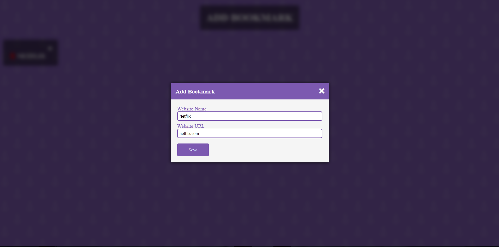
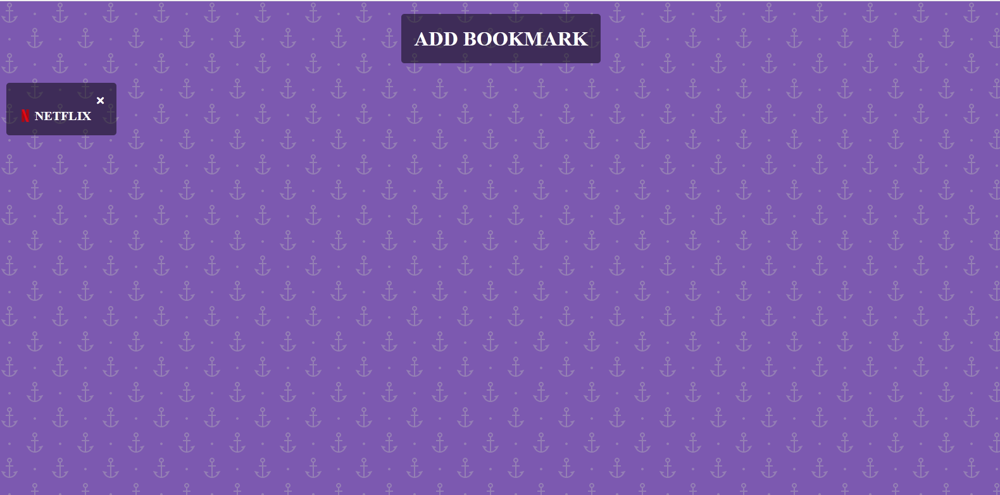

# Bookmark Keeper

#### Bookmark Keeper, 24rd Feb 2022

#### By Wilson Mwangeka

## Description

The custom Bookmark keeper is an app that enables you to add your favorite bookmarks and keep track of them. By default there's only one bookmark already preset in the localStorage when you first visit the site. You can choose to remove it and add your own bookmarks that'll be saved using localStorage enabling you to be able to view the bookmarks you have saved each time you visit the site.

## How To Interact with the Application
* The site is located at the url 

* At first load the site and then click on the Add Bookmark

* After clicking on the Add Bookmark a modal appears that has two input fields: name and url, they allow you to put the bookmark's name and the bookmark's URL. After inputting both of the fields with valid data. The bookmark is then displayed. You can add as many bookmarks as you'd like.

* You are also able to remove a bookmark by clicking on the close or times sign at the top of the bookmark.

## Known  Bugs
Currently there are no known bugs in the Custom Countdown Timer

## Technologies Used
I used HTML for the sites structure and CSS for the styling and visual presentation and finally JS for the functionality.

## Support and Contact Details
Incase of any question or feedback feel free to reach out to me on my personal email @wilsonmwangeka8@gmail.com

### License

*MIT License*
Copyright (c) 2022 